  

  
  
  
  

  
   
  AI Engineering · Computer Vision · Full-Stack (Spring Boot / Angular) · MLOps on AWS

---

##  &nbsp;About

I build **AI systems end to end**: the model (computer vision, anomaly detection, LLM + RAG),
the **real-time data pipeline** behind it (Kafka, Spark Structured Streaming), and the **secure
full-stack application** that puts it in front of users (Java Spring Boot, Angular), containerised
and deployed on **AWS**.

I care about the parts that make a model usable in production: latency budgets, thresholds tuned on
business cost rather than accuracy, explainability for the people who act on alerts, and
**security built in from the start** (least-privilege IAM, encryption at rest, audit logs, image scanning).

`MSc Artificial Intelligence & Digital Computing · 2025–2027 · FST Béni Mellal, Université Sultan Moulay Slimane`

---

##  &nbsp;Flagship work

### 🛡️ SecureOps AI — Anomaly-detection copilot with an investigation agent

A secure full-stack platform that scores anomalies and lets an **AI agent prepare the investigation,
while a human makes every sensitive decision.**

| | |
|---|---|
| Scoring | **XGBoost** model ranks incoming alerts by risk |
| AI agent | **LLM + RAG** enriches each alert with a contextual summary and a recommended action |
| Guardrails | **No autonomous execution** — mandatory human approval on every sensitive step, immutable audit log |
| Backend | Java **Spring Boot** REST API — Spring Security, **JWT/OAuth2**, RBAC, rate limiting |
| Frontend | **Angular** console to visualise, triage and resolve alerts |
| Cloud | **AWS** ECS Fargate · RDS PostgreSQL · S3 (audit) · Secrets Manager — encryption at rest, least-privilege IAM, **Trivy**-scanned images |

`Spring Boot` `Angular` `XGBoost` `LLM/RAG` `Docker` `AWS` &nbsp;·&nbsp; 🔒 private — demo on request

### 🦺 HSE Vision — Real-time safety monitoring · *Holcim internship*

Multi-camera system that detects **missing PPE** and **dangerous vehicle manoeuvres** on an industrial site.

- **YOLOv8** trained by transfer learning (**85% accuracy**), multi-object tracking with **ByteTrack**, OpenCV preprocessing
- Video inference pipeline running at **5 FPS** per camera
- **Event-driven, containerised architecture**: detections streamed through **Kafka**, per-camera statistics aggregated continuously with **Spark Structured Streaming**

`YOLOv8` `ByteTrack` `OpenCV` `Kafka` `Spark` `Docker` &nbsp;·&nbsp; 🔒 internship work — not public

---

##  &nbsp;Projects

<table>
<tr>
<td width="50%" valign="top">

#### 🌐 NIDS-FL — Federated intrusion detection

Network intrusion detection where **models travel, raw traffic never does.**

- **FedAvg** across 3 clients: **65 KB** of compressed weights per round instead of centralising **1.2 GB**
- **Hybrid Edge/Cloud**: local MLP **99.38%**, cloud XGBoost **99.44%** (7 classes)
- **Continual learning** with a replay buffer: **−2%** F1 over 8 weeks of drift vs **−16%** for a static model

`TensorFlow` `XGBoost` `FedAvg`

</td>
<td width="50%" valign="top">

#### 💳 Unsupervised fraud detection

VAE · Isolation Forest · LSTM-AE on unlabelled transactions at a **0.12% fraud rate**.

- Model selected on **AUC-PR**: VAE **0.1139** (≈ **95×** random, **+129%** vs Isolation Forest)
- Decision threshold calibrated on **business cost** → **−24%** operational cost
- **Streamlit** dashboard with per-transaction **SHAP** explanations

`TensorFlow` `scikit-learn` `SHAP` `Streamlit`

</td>
</tr>
<tr>
<td width="50%" valign="top">

#### 🔎 [ResearchWatch](https://github.com/khaidermohamedd/ResearchWatch)

Semantic search engine for scientific papers: arXiv corpus → cleaning and de-duplication →
**384-d sentence embeddings** indexed as `dense_vector` in **Elasticsearch 8**, explored in **Kibana**.

`Python` `Elasticsearch` `Sentence-Transformers` `Kibana` `Docker`

</td>
<td width="50%" valign="top">

#### 🧪 [PROJET.IA — Feature selection study](https://github.com/khaidermohamedd/PROJET.IA)

Filter (CFS, information gain), PCA and **wrapper** feature selection compared across KNN, SVM,
Naive Bayes, MLP and random forest classifiers, against a no-selection baseline.

`Python` `scikit-learn` `Jupyter`

</td>
</tr>
<tr>
<td width="50%" valign="top">

#### ⚙️ ETL pipeline & dynamic dashboard

Data preprocessing and visualisation chain orchestrated with **Apache NiFi**.

`Apache NiFi` `Python`

</td>
<td width="50%" valign="top">

#### ✨ [Portfolio](https://github.com/khaidermohamedd/khaidermohamedd.github.io)

My personal site — loader, liquid-distortion hero, stacked project cards. Hand-written HTML/CSS/JS.

`HTML` `CSS` `JavaScript`

</td>
</tr>
</table>

---

##  &nbsp;Experience

| | Role | Company |
|---|---|---|
| **Jul – Aug 2026** | AI & Computer Vision intern — real-time HSE monitoring | **Holcim** · Agadir |
| **2025 · 2 months** | Full-stack intern — industrial maintenance app (Spring Boot REST API + React) | **OCP Group** · Khouribga |

---

##  &nbsp;Tech

| | |
|---|---|
| **AI & deep learning** | PyTorch · TensorFlow/Keras · scikit-learn · XGBoost · CNN (ResNet, U-Net) · RNN/LSTM · YOLOv5/v8 · OpenCV · federated learning (FedAvg) · FinBERT · LLM & RAG |
| **Full-stack** | Java (Spring Boot) · Angular · React · TypeScript · REST APIs · Spring Security (JWT/OAuth2) · HTML/CSS |
| **Cloud & MLOps** | AWS (ECS, EC2, RDS, S3, IAM, Secrets Manager) · Docker / Compose · Kafka · Spark Structured Streaming · CI/CD (GitHub Actions) |
| **Security** | RBAC · encryption at rest · rate limiting · least-privilege IAM · Trivy vulnerability scanning · audit logging |
| **Languages & data** | Python · Java · R · SQL · MongoDB · Neo4j |

---

**MSc — Artificial Intelligence & Digital Computing** · FST Béni Mellal, USMS · 2025–2027
**BSc — Distributed Computer Systems** · FST Marrakech, Cadi Ayyad University · 2024–2025
**DEUST — Science & Technology** · FST Marrakech, Cadi Ayyad University · 2022–2024

 

